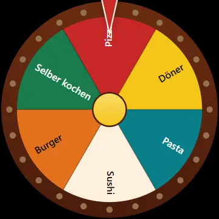

# Dreh das Rad



**➡️ Ausprobieren: [dennismit2n.github.io/dreh-das-rad](https://dennismit2n.github.io/dreh-das-rad/)** &nbsp;·&nbsp; 🇬🇧 [English version of this page](README.md)

Ein Entscheidungs-Glücksrad für alle Momente, in denen sich niemand festlegen will. Optionen eintippen, Rad drehen, das Los entscheidet — mit Jahrmarktlampen, klackendem Zeiger und Konfetti. Alles läuft im Browser: kein Server, kein Konto, kein Upload.

## Funktionen

- 🎡 **Ein Rad, das sich wie ein Rad benimmt** — 3 Sekunden Dreh mit langem, zähem Auslauf, ein Zeiger, den jeder Nocken zur Seite schnippt, und ein Ratschen, das mit sinkender Drehzahl tiefer wird
- 💡 **Jahrmarktlampen** — die Birnen am Kranz bleiben dunkel, bis das Rad steht; dann gehen sie schlagartig an und laufen im Lauflicht um
- ⚖️ **Gewichtung** — „Papa kocht x3“ belegt drei Felder statt einem
- ➖ **Ziehen und entfernen** — Gewinner vom Rad nehmen und weiterdrehen; Gezogene stehen nummeriert darunter, damit man in einem Rutsch eine ganze Reihenfolge auslost
- 🎨 **4 Farbwelten** — Kirmes, Neon, Pastell und Tinte, jede in Hell und Dunkel auf Beschriftungskontrast geprüft
- 🚀 **6 Schnellstart-Listen** — Ja/Nein, Kopf oder Zahl, Zahlen 1–10 sowie Essen, Was gucken? und Was machen?, für jede Sprache eigens zusammengestellt
- 🔗 **Teilen als Link, QR-Code oder übers Handy-Teilen-Menü** — der Empfänger bekommt dasselbe Rad und dreht selbst
- 🌍 **12 Sprachen** — Deutsch, English, Español, Français, Italiano, Português, Türkçe, Русский, हिन्दी, 中文, 日本語, 한국어 (automatisch erkannt)
- 📱 **Installierbare PWA** — Rad auf den Startbildschirm legen, funktioniert vollständig offline
- 🔒 **Radikal privat** — deine Optionen stecken im URL-*Fragment* (`#…`), das Browser niemals an einen Server schicken

## Ist das wirklich fair?

Ja, und zwar mit Absicht. Der Gewinner wird gezogen, **bevor** sich das Rad bewegt — mit `crypto.getRandomValues` und Rückweisungsstichprobe, damit kein Modulo-Bias entsteht und jedes Feld exakt dieselbe Chance hat. Erst danach wird die Zielrotation so berechnet, dass das Rad genau dort stehen bleibt. **Die Animation zeigt das Ergebnis, sie erzeugt es nicht.**

Ein physikalisch simuliertes Rad wäre nicht besser, sondern schlechter: Wo es stehen bliebe, hinge von Bildrate und Fließkomma-Drift ab. So sind die Chancen nachweisbar gleich — und dieselbe Ziehung funktioniert auch, wenn Animationen abgeschaltet sind.

## Barrierefreiheit

- `prefers-reduced-motion` wird respektiert: keine Drehung, kein Konfetti, kein Blinken — das Ergebnis blendet einfach ein. Weil die Drehung bei dieser App aber der eigentliche Punkt ist, gibt es zusätzlich den sichtbaren Schalter **„Rad drehen lassen“**, der das überstimmt und gespeichert wird.
- Jede Segmentbeschriftung bekommt automatisch die Farbe (Tinte oder Weiß), die besser kontrastiert; `tools/check-contrast.js` schlägt fehl, sobald eine Kombination unter WCAG AA (4,5:1) rutscht. Benachbarte Segmente werden über den Farbabstand ΔE geprüft — zwei Farben können gleich hell und trotzdem klar unterscheidbar sein.
- Ton erklingt ausschließlich als direkte Folge eines Klicks auf „Drehen“, und der Lautsprecher in der Kopfzeile schaltet ihn dauerhaft stumm.

## Datenschutz

Die ganze App besteht aus einer Handvoll statischer Dateien. Frage und Optionen werden in den Teil der URL nach dem `#` kodiert — das Fragment —, das dein Browser niemals überträgt. Ein geteiltes Rad bleibt also zwischen dir und den Leuten, denen du den Link schickst. Es gibt keinerlei Serverseite: Flugmodus an, es läuft trotzdem.

Der Seitentitel bleibt bewusst statisch und enthält nie deine Frage, damit nichts Persönliches in die Besucherzählung sickern kann.

*Statistik:* Die App nutzt [GoatCounter](https://www.goatcounter.com) für anonyme, cookiefreie Besucherzählung (im Fußbereich deklariert). Das Skript liegt lokal unter `js/vendor/count.js`; die einzige externe Anfrage ist das Zählpixel.

## Entwicklung

Kein Build-Schritt, keine Abhängigkeiten.

```bash
node tools/dev-server.js
```

Dann http://localhost:8617 öffnen. Bearbeiten, neu laden, fertig.

Zwei Prüfungen, die sich nach Änderungen an Farben oder Übersetzungen lohnen:

```bash
node tools/check-contrast.js && node tools/check-i18n.js
```

⚠️ Der Service Worker cached beherzt. Beim Entwickeln vor dem Testen abmelden und Caches leeren — und **bei jedem Deploy `CACHE` in `sw.js` hochzählen**.

### Die Animation im README

`tools/gif-recorder.html` nimmt einen Dreh mit genau demselben Zeichner auf, den auch die App benutzt (`js/wheel.js`) — was in der Aufnahme zu sehen ist, bekommen Besucher also exakt so. Über den Dev-Server öffnen, **Aufnehmen** drücken, und es entstehen `promo.gif` und `promo.webp` (animiert) im Download-Ordner; von dort nach `assets/` verschieben.

Der Dreh endet bei derselben Radstellung, bei der er beginnt — dadurch läuft die Schleife ohne sichtbaren Sprung. Die Voreinstellungen ergeben etwa 620 KB GIF und 440 KB WebP; eingebunden ist das WebP.

## Ideen für später

Ergebnis-Verlauf · Vollbild-Modus · Segmentreihenfolge mischen.

## Lizenz

MIT — siehe [LICENSE](LICENSE).
